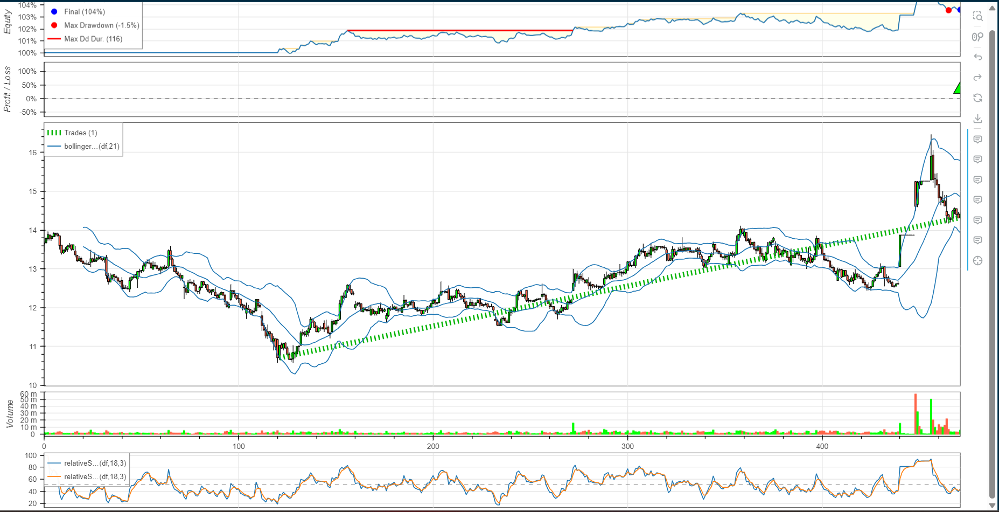

# Report: 

## Objective: 
To design a mean reversion strategy. Broad idea is to buy when the stock is oversold and exit the position when stock is overbought region. 
* `Constant Notional`: we can only hold 100 units of a stock, and cannot take partial positions. 
* We are not allowed to short sell a stock. 

### Metrics used to identify overbought or oversold: 
1. Bollinger Bands
    * There are two benefits of using bollinger bands. They tell us about volatility, and can also indicate overbought or oversold regions. 
    * We find a simple moving average taking the `n` previous days `close` value. We also find the `standard deviation` using the same values. 
    * The upper band is given by adding `2*std` to the `moving average`. 
    * The lower band is given by subtracting `2*std` from the `moving average`. 
    * Plotting the bollinger bands tells you that the price often moves within the bands. 
    * When price moves below the lower bollinger band, it indicates an overselling, and that there is a high chance that the price will revert to its long term moving average. 
    * When price moves above the upper bollinger band, it indicates an overbuying, and that there is a high chance that the price will revert to its long term moving average.

2. RSI(Relative Strength Index)
    - RSI is a momentum oscillator that measures the speed and change of price movements.
    - It ranges from 0 to 100 and is typically used to identify overbought or oversold conditions.
    - Readings above 70 indicate overbought conditions, suggesting a potential price reversal, while readings below 30 indicate oversold conditions, suggesting a potential price bounce.

3. MACD(Moving average Convergence Divergence)
    - MACD is a trend-following momentum indicator that shows the relationship between two moving averages of a security's price.
    - It consists of the MACD line (the difference between a short-term and long-term exponential moving average) and a signal line (typically a 9-day EMA of the MACD line).
    - Bullish signals occur when the MACD line crosses above the signal line, indicating upward momentum, while bearish signals occur when the MACD line crosses below the signal line.

4. Stochastic Indicator 
    - Stochastic is a momentum indicator that compares a security's closing price to its price range over a specific period.
    - It consists of two lines: %K, representing the current price relative to the highest and lowest prices over a specified period, and %D, a moving average of %K.
    - Readings above 80 indicate overbought conditions, suggesting a potential price reversal, while readings below 20 indicate oversold conditions, suggesting a potential price bounce.

**Note**: All the indicators were coded from scratch. Backtesting was done using a python library called `backtesting.py`. It has several interfaces which we can extend to create our own custom Strategies. 


### Results: 
* Comparing total returns of all strategies: Total returns of Buy And Hold strategy were evaluated assuming that 100 shares of each stock were bought on day 1, and all sold on last day. Hence we try to beat the 500 stocks equal-weighted. 
* For other strategies, a long position is established only when the strategy gives a signal, and the position is exit when there is an exit signal. The long positions in a single stock are exclusive, that is, one cannot enter another long position before exiting from the previous one.  
* Unoptimized Results are the results obtained by using the following default parameters: 
    ```JSON
    {
        "bb_window" : 30 ,
        "rsi_window" : 14,
        "rsi_smooth_window" : 3,
        "rsi_upper_thres" : 70 ,
        "rsi_lower_thres" : 30 ,
        "macd_fast_ma_length" : 26 ,
        "macd_slow_ma_length" : 12,
        "macd_signal_ma_length" : 9
    }
    ```
    * **Optimization**: Parameter Optimization was performed using [Grid Search Method](https://en.wikipedia.org/wiki/Hyperparameter_optimization#:~:text=Grid%20search%5B,other.%5B3%5D) 
        - Above mentioned parameters were individually optimized for each stock, hence every stock had its own set of parameters. 

**InSample Data**:   
`Total Returns measured from 2022-04-01 to 2022-06-30`
|Strategy | Buy and Hold | MACD | Bollinger Bands | 
|---------|-----|--------|----------| 
|Unoptimized| 29477.87 | 43177.0   | 45321.75|
|Optimized| 29477.87  | 76036.0 | 35047.25 |
- The optimization seems to perform poorly on Bollinger Bands. 

**OutSample Data**:   
`Total Returns measured from 2022-07-01 to 2022-07-31`
|Strategy | Buy and Hold | MACD | Bollinger Bands | 
|---------|-----|--------|----------| 
|Unoptimized| -104645.58 | -10180.0   | -2186.10 |
|Optimized| -104645.58  | -11947.0 | -2652.40 |

- The optimization seems to perform poorly on outsample dataset for both macd and bollinger bands, But in both the cases the losses were minimized by approximately 90%. Where the simple buy and hold strategy would have incurred a loss of around 1_00_000, our Strategies incurred only a loss of around 10_000\~11_000
- We can see that optimizing parameters for each stock individually tends to overfit our model, and hence should be avoided. 


The Plots Generated are saved as *html* files and can be viewd on a browser. The Charts are interactive in nature.  
  


### Further optimizations: 
* **Trailing Stop Losses**: Many of times it was observed that a good long position was taken, the price of the stock rose to a high, and without triggering any critical danger, slowly started falling down, while the strategy kept waiting for an alert. This can be prevented using Trailing Stop Losses. Trailing stop losses are stop losses that are adjusted as and when the price rises for our long position. 
    * Difficulty: difficulty in integrating with backtesting library's framework. One can also use ATR to calculate trailing stop losses. 

* **Support and Resistance Levels**: 
    * Bollinger Band Strategy is preferrably suited for sideways market. By Identifying Support and Resistance Levels and using them to identify sideways market, we can make the buy signals more linient for Bollinger Band Strategy. 
    * We can set targets and stop losses more accurately only we identify support and resistence levels. 
    * One way to identify Support and Resistance Levels in python, can be using K-Means Clustering. 

* Using all indicators together to generate more accurate signals: 
    * Difficulty: 
        * MACD is a lagging indicator, while Bollinger Bands and RSI are leading indicators. This causes difficulty for them to work together. 
        * Overfitting: Very Often looking at a result of a strategy and trying to generate more potentially good buy signals, and trying to reduce riskier positions, one tends to write conditions that are actually overfitted to a certain stock or types of stocks. This causes poorer generalization of strategies. 


<!-- 


Profit from Simple Buy and Hold Strategy: 29477.869999999995.  

Without Optimization:   
Profit from bb strategy: 45321.74999999992  
Profit from macd strategy: 43177.0   -->